# aws-security-lab

When it comes to security with cloud, systems must be protected and hardened so that important information won't be taken and compromised. 

# KMS Key
Go to KMS and on the left pane, choose Customer managed keys, then go and select create key and see these steps:    
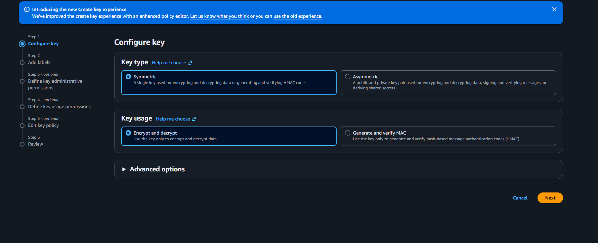    
Keep it on the symmetric option and encrypt and decrypt, then hit next and for Alias name have it be SecurityLab-S3-Key.    
But before going any further. go to IAM and create a user dedicated to kms-admin but clicking on create user and naming it kms-admin with the option to provide access to the command line, then hit next and select the option of attaching the AWS managed policy directly and choose AWSKeyManagementServicePowerUser, then review and click on create user and save the info provided. 

After naming the key, go to key admin permissions and select the kms-admin role that was just created and hit next until you see create and click on create to create or finish.

Make sure to also for the kms-admin to have a policy that allows for CloudTrail to encrypt logs. So add this policy to the initial after clicking edit in permissions:  
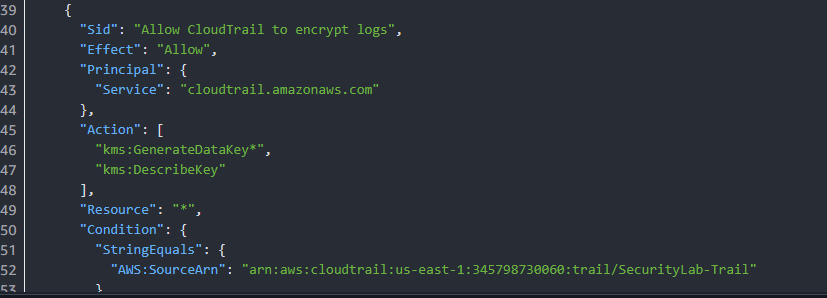   

# S3 Bucket
Next go to S3 and click on create a bucket. For the first bucket name it jwt-security-lab-datav2 with public access blocked, enable bucket versioning, have encryption set to SSE-KMS or Server-Side Encryption, then for AWS KMS key select choose from existing and choose the one that was created and then have the bucket key enabled and hit create the first bucket. 
Then create a second bucket named jwt-security-lab-logs and leave it default and hit create. Then go to the security-lab-datav2 and go to properties, then scroll down to server access logging and hit edit. Change the server access logging from disable to enable and for the target bucket choose the lab-logs bucket and click on choose destination. Then in the destination after -logs add /s3-access-logs/ which should pop up for the Destination bucket name and destination prefix. Then click on save changes.    
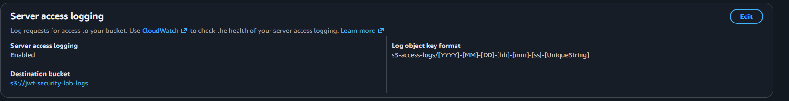  

# CloudTrail
Then go to CloudTrail and click on create trail. Name the trail SecurityLab-Trail and hit create. After creation, double click on it and in general details click on edit and should be able to edit. For storage location, click on create a new S3 bucket and name it jwt-security-lab-cloudtrail. Then have enabled the Log File SSE-KMS encryption and for AWS KMS key have it existing and choose the S3 Security Lab alias. Then go and edit the CloudWatch logs and make sure that is disabled for logs. 
Then go to management events and click on edit and choose the read and write permissions or check to see if both are enabled

# IAM
Go to IAM and in the left pane choose policies and click on create policy and for the policy editor go to JSON and put this into it:    
{   
  "Version": "2012-10-17",  
  "Statement": [    
    {   
      "Sid": "ListBucket",  
      "Effect": "Allow",    
      "Action": "s3:ListBucket",    
      "Resource": "arn:aws:s3:::jwt-security-lab-data-v2",  
      "Condition": {    
        "StringLike": { 
          "s3:prefix": ["public/*"] 
        }   
      } 
    },  
    {   
      "Sid": "ReadPublicPrefix",    
      "Effect": "Allow",    
      "Action": [   
        "s3:GetObject", 
        "s3:GetObjectVersion"   
      ],    
      "Resource": "arn:aws:s3:::jwt-security-lab-data-v2/public/*"  
    },  
    {   
      "Sid": "DecryptWithKMS",  
      "Effect": "Allow",    
      "Action": [   
        "kms:Decrypt",  
        "kms:DescribeKey"   
      ],    
      "Resource": "arn:aws:kms:us-east-1:ACCOUNT_ID:key/KEY_ID" 
    }   
  ] 
}   
In the resouce lin change ACCOUNT_ID to yours and the KEY_ID to the key created earlier, then hit next and name it SecurityLab-S3-ReadOnly-Contractor then hit create policy.
Then go and create another policy that is Admin with Full Control but with restrictions and like earlier and put this into it:  
{   
  "Version": "2012-10-17",  
  "Statement": [    
    {   
      "Sid": "FullS3Access",    
      "Effect": "Allow",    
      "Action": "s3:*", 
      "Resource": [ 
        "arn:aws:s3:::jwt-security-lab-datav2",    
        "arn:aws:s3:::jwt-security-lab-datav2/*"   
      ] 
    },  
    {   
      "Sid": "KMSAccess",   
      "Effect": "Allow",    
      "Action": [   
        "kms:Decrypt",  
        "kms:Encrypt",  
        "kms:GenerateDataKey",  
        "kms:DescribeKey"   
      ],    
      "Resource": "arn:aws:kms:us-east-1:ACCOUNT_ID:key/KEY_ID" 
    },  
    {   
      "Sid": "DenyPublicBucketChanges", 
      "Effect": "Deny", 
      "Action": [   
        "s3:PutBucketPublicAccessBlock",    
        "s3:PutBucketPolicy"    
      ],    
      "Resource": "arn:aws:s3:::jwt-security-lab-datav2",  
      "Condition": {    
        "StringNotEquals": {    
          "aws:PrincipalArn": "arn:aws:iam::ACCOUNT_ID:user/SecurityAdmin"  
        }   
      } 
    }   
  ] 
}   
In resouce line do like before, hit next and name the policy SecurityLab-S3-Admin and then click on create policy. 
Then go and create two roles a contractor and a admin role. Click on create role and for trusted entity type choose AWS Service, then for use case EC2, then hit next and for policy choose the SecurityLab-S3-ReadOnly-Contractor and hit next. For role name name it Security-ReadOnly-Contractor with a description that says read only for contractors and hit create role. 
Then create a second role like before named EC2-Admin-Role, trusted entity like before with EC2 and hit next, for policy choose the SecurityLab-S3-Admin with a description of admin access only and hit create role.   

# GuardDuty
For GuardDuty, it comes with a 30 day free trial so you can cancel it at any time. Go to GuardDuty and click on get started and then hit enable GuardDuty.  
  

# AWS Config
In AWS Config, you can click on Get STarted if its your first time and you will see this: 
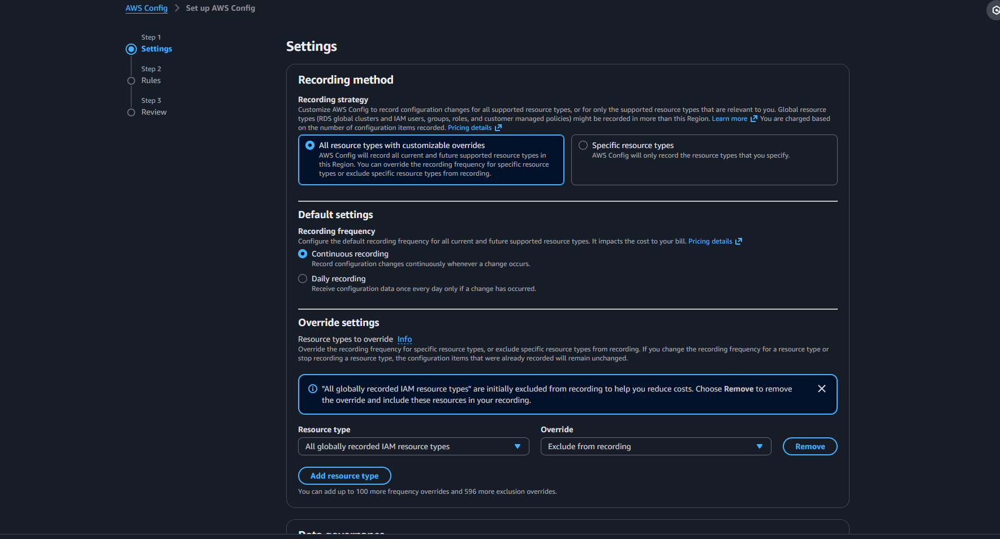  
For recordking strategy, keep it all resouce types and then scroll down to s3 buckets and select the create new option and name it jwt-security-lab-config. Then for rules have these selected.
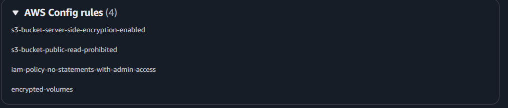  
Read-Prohibited detects public buckets, server-side enforces encryption, admin-access detects for certain policies, and volumes checks to EC2 EBS volumes. Then click on confirm. After creation should look like this: 
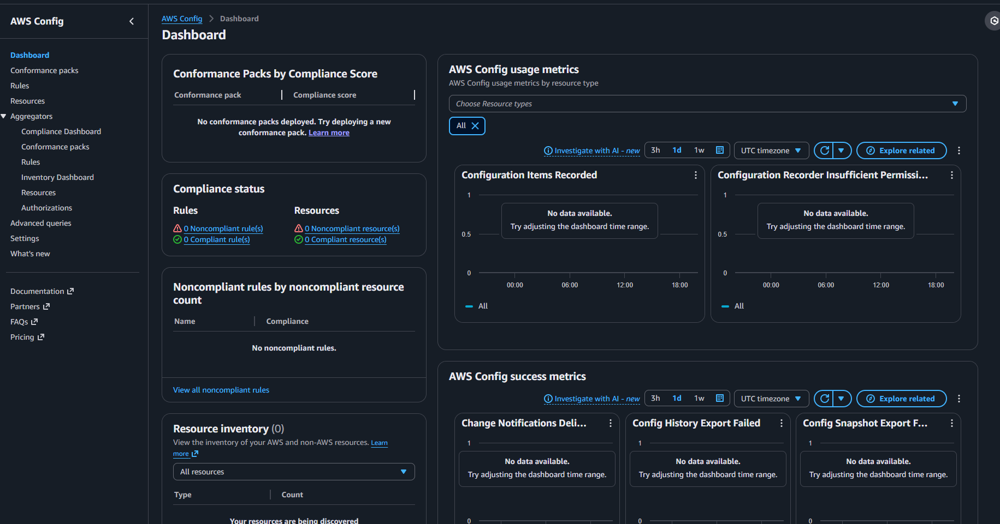 

# EC2 Launch
In EC2 go to Instances and create two instances for the roles created earlier, Security-lab-S3-ReadOnly-Contractor and EC2-Admin-Role2. Click on launch/create instance. 
Name the first instance SecurityLab-Contractor with Amazon Linux as the AMI, t2.micro, then scroll down to advanced settings, go to IAM instance profile and choose the ReadOnly-Contractor, then scroll up a little and go to storage and click on advanced for the dropdown menu to appear like so: 
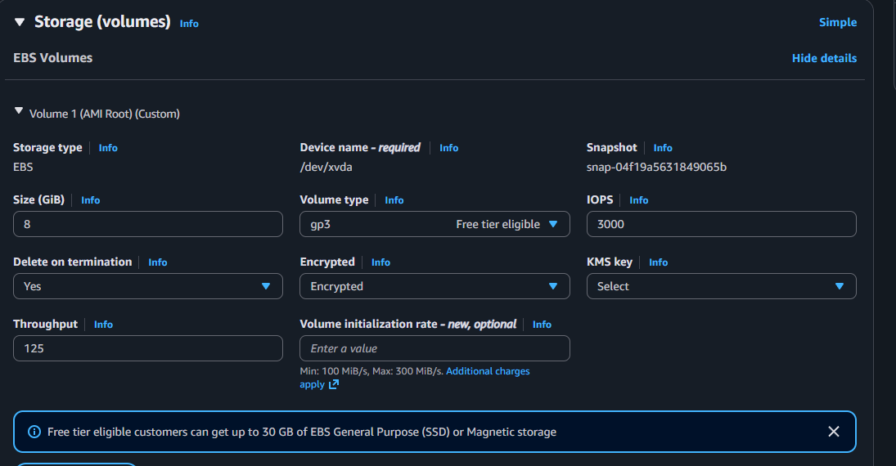  
For encrypted section, change it to encrypted and then click on launch instance.  
The create a key pair section will pop, so click on create new key pair and name it SecurityLab-KeyPair with RSA and .pem and it launch instance.
Then create a second instance for EC2-Admin-Role2 with the same settings as before and hit launch instance. 

# Test Data Creation
In the command line on the host machine go and create echo files that will be used. 
Type echo "Public dataset - weather data" > weather.csv, then echo "CONFIDENTIAL: API Key randomnumbers", then echo "CLASSIFIED: Satellite imagery coordinates" > classified-data.txt
Make sure to also configure the aws profile on the host machine to the kms-admin for to work and to also create access keys to sign in as well. To save and change over type aws sts get-caller-identity to see if you need to change or not, if you do type $env:AWS_PROFILE = "kms-admin" to verify.  
Then go to KMS key created and edit the key policy to prevent this error from popping up: 
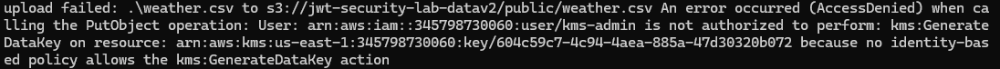 
By adding the policy: 
{ 
    "Sid": "AllowKMSAdmin", 
    "Effect": "Allow",  
    "Principal": {  
        "AWS": "arn:aws:iam::345798730060:user/kms-admin" 
    },  
    "Action": [ 
        "kms:GenerateDataKey",  
        "kms:Decrypt",  
        "kms:Encrypt" 
    ],  
    "Resource": "*" 
} 
Then go to kms-admin in IAM and attach the AmazonS3FullAccess policy and hit save.  
Then back in the host, type aws s3 cp weather.csv s3://jwt-security-lab-datav2/public/weather.csv and it should upload. 
Then for the second type aws s3 cp api-credentials.txt s3://jwt-security-lab-datav2/restricted/api-credentials.txt and it should upload.
Then for the third, type aws s3 cp classified-data.txt s3://jwt-security-lab-datav2/restricted/classified-data.txt and it should upload.  

# Least Privlege Testing
First go create a normal-user user that has AmazonS3ReadOnlyAccess permission and in the kms key policy add this: 
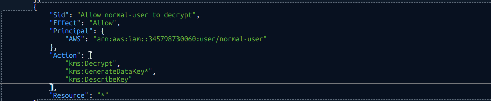  
Then hit save changes.  
And with AWS configure change the user by typing $env:AWS_PROFILE = "" and entering in the access key id and secret key and us-east-1.  
For the first test type aws s3 cp://jwt-security-lab-datav2/public/weather.csv . --profile normal-user or just assume the role of the contractor, which should pop up the message of successful download. Then type cat weather.csv to confirm that the data can be seen.  
For the second test type aws s3 cp s3://jwt-security-datav2/restricted/api-credentials.txt and should see this error: 
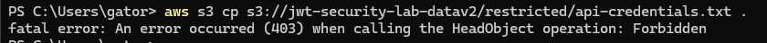  
Error means that access was not allowed due to least privelege principle. Should also work for the Security-ReadOnly-Contractor role after being given the correct permissions.
For the third test type aws s3 ls s3://jwt-security-lab-datav2/restricted/ and should see this: 
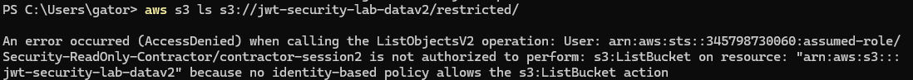    
Then switch over the EC2-Admin role and test once again by typing $env:AWS_PROFILE = "", $env:AWS_PROFILE = "", then $env:AWS_ACCESS_KEY_ID = "", AWS_SECRET_ACCESS_KEY = "", AWS_SESSION_TOKEN = "", then ws sts assume-role --role-arn "arn:aws:iam::345798730060:role/EC2-Admin-Role2" --role-session-name "my-session2". Which should output the data needed for temp access. 
For the first test type aws s3 cp s3://jwt-security-lab-datav2/restricted/classified-data.txt . which should download and be able to see the contents by typing cat classified-data.txt:  
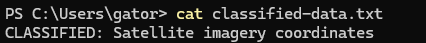  
Next type aws s3 rm s3://jwt-security-lab-datav2/public/weather.csv which should delete it as the second test.  
For the third test type aws s3api put-public-access-block --bucket jwt-security-lab-datav2 --public-access-block-configuration BlockPublicAcls=false which should output a access denied message.  
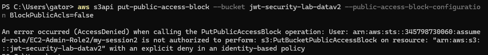  

To assume either of the two roles, EC2-Admin2 and Security-ReadOnly-Contracter you will need to go back and edit their policies and update the KMS policy and bucket.
For EC2-Admin2:
Go to kms-admin and add the policy:   
{ 
    "Version": "2012-10-17",  
    "Statement": [  
        { 
            "Effect": "Allow",  
            "Action": "sts:AssumeRole", 
            "Resource": "arn:aws:iam::345798730060:role/EC2-Admin-Role2"  
        } 
    ] 
} 
Then go and update the trust relationship and add this: 
{ 
    "Version": "2012-10-17",  
    "Statement": [  
        { 
            "Effect": "Allow",  
            "Principal": {  
                "Service": "ec2.amazonaws.com"  
            },  
            "Action": "sts:AssumeRole"  
        },  
        { 
            "Effect": "Allow",  
            "Principal": {  
                "AWS": "arn:aws:iam::345798730060:user/fargate-cli-user"  
            },  
            "Action": "sts:AssumeRole"  
        } 
    ] 
}
Then in the command line type aws sts assume-role --role-arn "arn:aws:iam::345798730060:role/EC2-Admin-Role2" --role-session-name "my-session"  
Which should output further info needed such as AWS_ACCESS_KEY_ID, AWS_SECRET_ACCESS_KEY, and AWS_SESSION_TOKEN by starting with $env for each. 
Then go back to KMS key and add this policy:  
{ 
    "Sid": "Allow EC2-Admin-Role2 to use key",  
    "Effect": "Allow",  
    "Principal": {  
        "AWS": "arn:aws:iam::345798730060:role/EC2-Admin-Role2" 
    },  
    "Action": [ 
        "kms:GenerateDataKey*", 
        "kms:Decrypt",  
        "kms:DescribeKey" 
    ],  
    "Resource": "*" 
}  
Then go back to add permissions in IAM and create a inline policy and add this: 
{ 
    "Version": "2012-10-17",  
    "Statement": [  
        { 
            "Effect": "Allow",  
            "Action": [ 
                "s3:PutObject", 
                "s3:GetObject", 
                "s3:DeleteObject" 
            ],  
            "Resource": "arn:aws:s3:::jwt-security-lab-datav2/*"  
        },  
        { 
            "Effect": "Allow",  
            "Action": "s3:ListBucket",  
            "Resource": "arn:aws:s3:::jwt-security-lab-datav2"  
        } 
    ] 
} For the resouce have it set correctly with the arn, accountID key/followed by some other info
Then clear the $env variables and reassume the role
For Security-ReadOnly-Contracter: 
Go to trust relationships and add:  
{ 
    "Effect": "Allow",  
    "Principal": {  
        "AWS": "arn:aws:iam::345798730060:user/fargate-cli-user"  
    },  
    "Action": "sts:AssumeRole"  
} 
Clear the $env variables and assume the role by typing: aws sts assume-role --role-arn "arn:aws:iam::345798730060:role/Security-ReadOnly-Contractor" --role-session-name "contractor-session" 
Then get the creds generated by typing it the $envs like before and verify by typing aws sts get-caller-identity. 
Then go to KMS policies and and this:  
{ 
    "Effect": "Allow",  
    "Action": [ 
        "kms:Decrypt",  
        "kms:DescribeKey" 
    ],  
    "Resource": "arn:aws:kms:us-east-1:345798730060:key/604c59c7-4c94-4aea-885a-47d30320b072" 
} 
Then go to polciies for SecurityLab-S3-ReadOnly-Contractor and add the polcies or update it:  
{ 
    "Version": "2012-10-17",  
    "Statement": [  
        { 
            "Sid": "ListBucket",  
            "Effect": "Allow",  
            "Action": "s3:ListBucket",  
            "Resource": "arn:aws:s3:::jwt-security-lab-datav2", 
            "Condition": {  
                "StringLike": { 
                    "s3:prefix": ["public/*"] 
                } 
            } 
        },  
        { 
            "Sid": "ReadPublicPrefix",  
            "Effect": "Allow",  
            "Action": [ 
                "s3:GetObject", 
                "s3:GetObjectVersion" 
            ],  
            "Resource": "arn:aws:s3:::jwt-security-lab-datav2/public/*" 
        },  
        { 
            "Sid": "DecryptWithKMS",  
            "Effect": "Allow",  
            "Action": [ 
                "kms:Decrypt",  
                "kms:DescribeKey" 
            ],  
            "Resource": "arn:aws:kms:us-east-1:345798730060:key/604c59c7-4c94-4aea-885a-47d30320b072" 
        } 
    ] 
} 
Then clear the $env variables and assume the by typing: aws sts assume-role --role-arn "arn:aws:iam::345798730060:role/Security-ReadOnly-Contractor" --role-session-name "contractor-session2"  
Then enter the info for the essential $env variables. After that everything should work correctly like above.

# Vulnerability Introduced
For the vulnerabilites, the ones that will be tested will be relating to KMS key policy misconfiguration, S3 Bucket Policy Cross Connect, Overally permissive IAM Assumerole Trust, CloudTrail disabled, Unencrypted EBS Volume.  
Vulnerability 1 relates to NIST 800-53 SC-12, 2 related to AC-3 for access enforcement, 3 to AC-2 for account management, 4 to AU-2 and AU-9 for audit events and information protection, and 5 to SC-28 for protection of info at rest.  

To Test the first vulnerability, go to the SecurityLab-S3-Key and go its policies and add a statement allowing for Public decryption
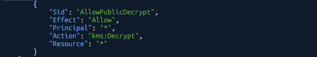  
For the second vulnerablity, go to the jwt-security-lab-datav2 bucket -> permissions and to bucket policy and add a statement that would disable the blocking of public access. Start by going to edit bdit block public access and turn it off and add thsi policy afterwards: 
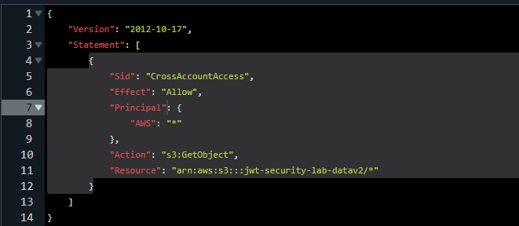  
For the third vulnerability, go to the Contractor role -> trust relationships and click on edit and change it to this:  
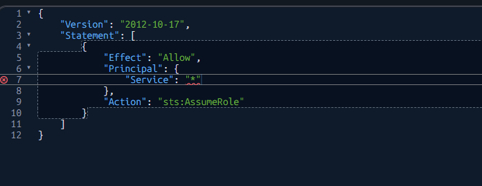  
The red underline for the * means overly permissive but save anyway. for it to work properly change it to AWS: "*" since it will interpert Service version differently. 
For the fourth vulnerability, go to CloudTrail -> SecurityLab-Trail and tell it to stop logging.
For the fifth vulnerability, go to EC2 and launch a instance that is vulnerable with no encryption in the storage section.  

# Advanced Detection with IAM Access Analyzer
Go to the IAM Access Analyzer and see this screen:  
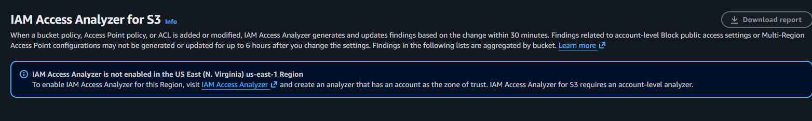 
Click on the IAM Access Analyzer hyperlink which should take you to this page:  
  
Then click on create analyzer. For analysis select the resource analysis, name it test and for zone of trust current account and hit create analyzer. Then go and wait I guess for a few minutes. 
After a few minutes, some findings should appear with the important ones being up top:  
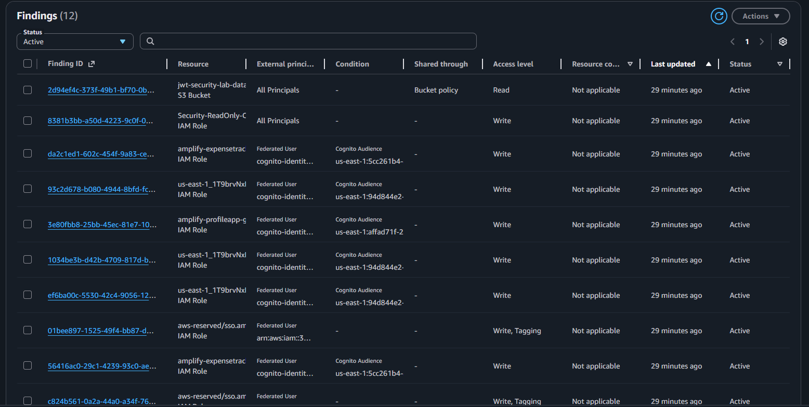 
First alert relates to the S3 bucket being accessible to all and second being every IAM role being overly permissive. The rest of the alerts in the screenshot are not tied to this lab.  
Then go to AWS config and check for non-compliant resources like so:  
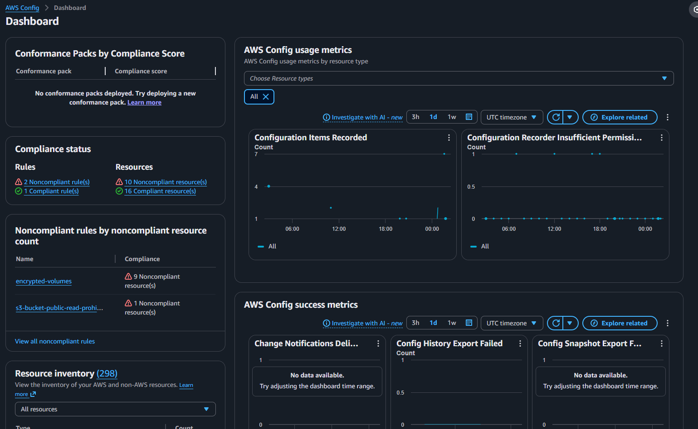 
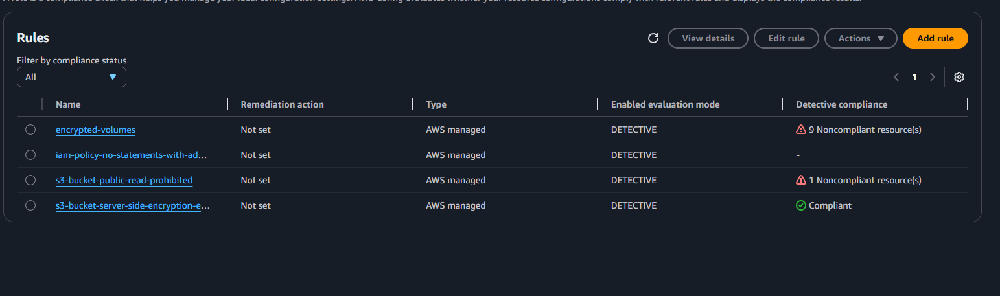  
Then in the contractor instance role type for ($i = 1; $i -le 100; $i++) { aws s3 ls } which should pop up with 100 or so access denied errors which will take some minutes.
